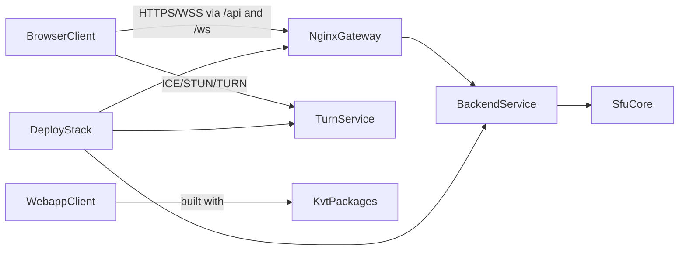

# Documentation

This documentation is split into four tracks.

## KVT framework docs

Use this track when you need to understand or extend the framework packages:

- `@kvt/core`
- `@kvt/react`
- `@kvt/theme`

Start with [KVT overview](./kvt/guide/index.md).

## Webapp onboarding docs

Use this track when you join the product project and need to understand conventions, feature
boundaries, UI rules, i18n, and how the app is assembled.

Start with [Webapp onboarding](./webapp/index.md).

## Backend docs

Use this track when you need backend architecture and runtime details for API, signaling, and SFU.

Start with [Backend overview](./backend/index.md).

## Product architecture onboarding

Use this track when you need a full-system view of how frontend, backend, SFU signaling, and
infrastructure work together.

### System overview

The product consists of four major parts:

- `app/webapp` - React client and user flows.
- `app/kvt` - local framework packages used by webapp.
- `backend` - Go API + signaling + SFU orchestration.
- `deploy` - nginx gateway + backend + web + TURN runtime topology.

### How service interactions flow

1. User opens webapp through nginx.
2. Webapp calls REST API and opens WebSocket signaling.
3. Backend coordinates room/session state and SFU publish/subscribe tracks.
4. Browser media flows directly over WebRTC with TURN fallback when needed.

Read details in:

- [Project Overview](./project/overview.md)
- [Service Interactions](./project/service-interactions.md)
- [Onboarding Path (30/60/120 minutes)](./project/onboarding-path.md)

## Quick links

- [KVT Dependency Injection](./kvt/guide/dependency-injection.md)
- [KVT ViewModel Lifecycle](./kvt/guide/viewmodel-lifecycle.md)
- [Webapp Architecture](./webapp/architecture.md)
- [Webapp Conventions](./webapp/conventions.md)
- [Backend Overview](./backend/index.md)
- [Project Overview](./project/overview.md)
- [Service Interactions](./project/service-interactions.md)
