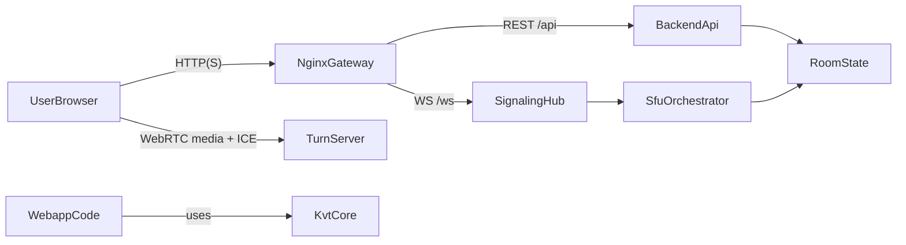

# Project Overview

This page gives a fast, full-system map for onboarding.

## Product components

| Component | Path | Responsibility |
| --- | --- | --- |
| Webapp | `app/webapp` | User-facing UI, feature flows, API/signaling clients, media UX. |
| KVT framework | `app/kvt` | Shared app primitives: DI, ViewModel lifecycle, flows, theme, React adapter. |
| Backend | `backend` | Room/session lifecycle, REST API, signaling, SFU orchestration, health/API docs. |
| Deploy | `deploy` | Runtime topology: nginx gateway, backend, web static app, TURN. |

## High-level architecture

## What each layer owns

- **Webapp**: routes, feature boundaries, state->view rendering, user actions.
- **KVT**: technical app framework, not product business entities.
- **Backend**: room/session business invariants and WebRTC signaling control-plane.
- **Deploy**: network topology and environment for end-to-end operation.

## Where to dive deeper

- Service-level interactions: [Service Interactions](./service-interactions.md)
- Practical onboarding route: [Onboarding Path](./onboarding-path.md)
- Frontend architecture details: [Webapp Architecture](../webapp/architecture.md)
