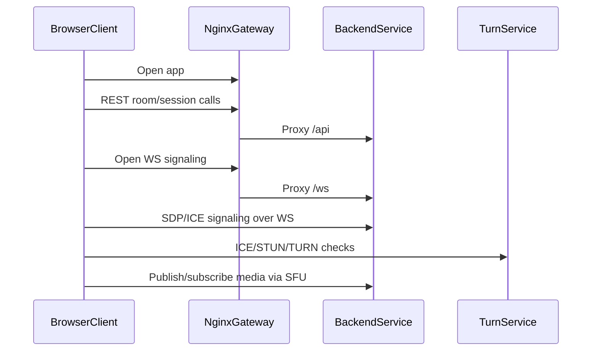

# Service Interactions

This page explains how services interact across control plane and media plane.

## Control plane and media plane

| Plane         | Main channel                     | Purpose                                                | Participants               |
| ------------- | -------------------------------- | ------------------------------------------------------ | -------------------------- |
| Control plane | HTTPS + WSS                      | Room APIs, join flow, signaling messages, diagnostics. | Browser, nginx, backend    |
| Media plane   | WebRTC (ICE/STUN/TURN, RTP/RTCP) | Real-time audio/camera/screen transport.               | Browser, backend SFU, TURN |

## End-to-end flow: join room

## Interaction ownership table

| Interaction             | Owner (client)                    | Owner (server)                           | Contract source                       | Debug first                          |
| ----------------------- | --------------------------------- | ---------------------------------------- | ------------------------------------- | ------------------------------------ |
| Room/session REST       | Webapp capabilities + features    | Backend HTTP adapters/application        | Swagger/OpenAPI                       | backend logs + `/api/swagger`        |
| Signaling WS messages   | Webapp RTC/signaling capability   | Backend signaling adapter/protocol       | Protocol contracts in backend         | browser exported logs + backend logs |
| SFU track orchestration | Webapp media/RTC flows            | Backend media adapter/domain/application | WebRTC signaling + runtime invariants | backend logs + client diagnostics    |
| TURN relay/fallback     | Browser ICE agent + webapp config | TURN + deploy config                     | deploy environment values             | turn/nginx/backend logs              |

## Common failure points

- `room-not-found` after backend restart (single-node, in-memory runtime).
- Missing or invalid TURN/ICE env values for target network.
- WS signaling channel up, but negotiation fails due to SDP/ICE mismatch.
- Browser permissions/device constraints before media publish.
