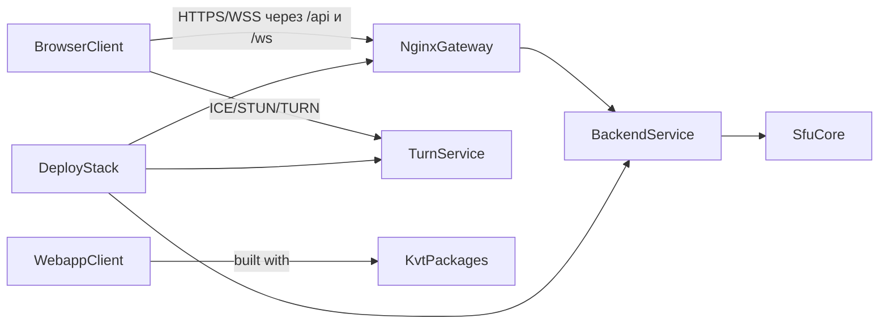

# Документация

Документация разделена на четыре трека.

## Документация KVT framework

Этот трек нужен, когда ты изучаешь или расширяешь framework packages:

- `@kvt/core`
- `@kvt/react`
- `@kvt/theme`

Начни с [обзора KVT](./kvt/guide/index.md).

## Документация webapp onboarding

Этот трек нужен новым разработчикам продукта: здесь описаны conventions, feature boundaries, UI
правила, i18n и сборка приложения.

Начни с [онбординга webapp](./webapp/index.md).

## Документация backend

Этот трек нужен, когда требуется backend-архитектура и runtime-детали для API, signaling и SFU.

Начни с [обзора backend](./backend/index.md).

## Онбординг по архитектуре продукта

Этот трек нужен, когда требуется целостное понимание системы: как frontend, backend, SFU/signaling
и инфраструктура работают вместе.

### Обзор системы

Продукт состоит из четырех основных частей:

- `app/webapp` - React-клиент и пользовательские сценарии.
- `app/kvt` - локальные framework packages, на которых построен webapp.
- `backend` - Go API + signaling + SFU orchestration.
- `deploy` - runtime-топология nginx gateway + backend + web + TURN.

### Как идут взаимодействия сервисов

1. Пользователь открывает webapp через nginx.
2. Webapp вызывает REST API и поднимает WebSocket signaling.
3. Backend координирует room/session state и SFU publish/subscribe потоки.
4. Browser media идет по WebRTC напрямую, с TURN fallback при необходимости.

Детали в отдельных страницах:

- [Обзор проекта](./project/overview.md)
- [Взаимодействие сервисов](./project/service-interactions.md)
- [Маршрут онбординга (30/60/120 минут)](./project/onboarding-path.md)

## Быстрые ссылки

- [KVT Dependency Injection](./kvt/guide/dependency-injection.md)
- [KVT ViewModel lifecycle](./kvt/guide/viewmodel-lifecycle.md)
- [Архитектура webapp](./webapp/architecture.md)
- [Конвенции webapp](./webapp/conventions.md)
- [Обзор backend](./backend/index.md)
- [Обзор проекта](./project/overview.md)
- [Взаимодействие сервисов](./project/service-interactions.md)
