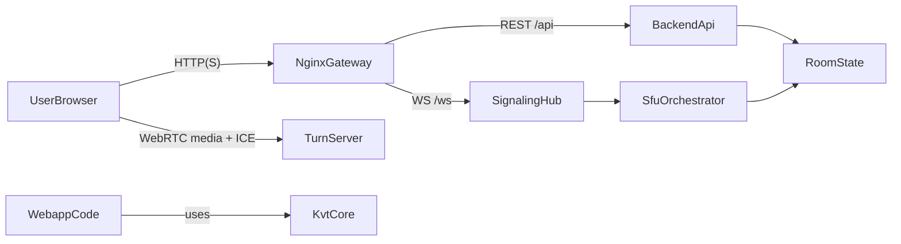

# Обзор проекта

Эта страница дает быстрый целостный обзор системы для онбординга.

## Компоненты продукта

| Компонент | Путь | Зона ответственности |
| --- | --- | --- |
| Webapp | `app/webapp` | Пользовательский UI, feature-флоу, API/signaling clients, media UX. |
| KVT framework | `app/kvt` | Общие framework primitives: DI, lifecycle ViewModel, flows, theme, React adapter. |
| Backend | `backend` | Room/session lifecycle, REST API, signaling, SFU orchestration, health/API docs. |
| Deploy | `deploy` | Runtime-топология: nginx gateway, backend, web static app, TURN. |

## Высокоуровневая архитектура

## Что принадлежит каждому слою

- **Webapp**: роутинг, feature boundaries, отображение state, пользовательские действия.
- **KVT**: технический каркас приложения, без продуктовых бизнес-сущностей.
- **Backend**: бизнес-инварианты room/session и control-plane WebRTC signaling.
- **Deploy**: сетевая топология и среда для end-to-end работы.

## Куда читать дальше

- Детали взаимодействий: [Взаимодействие сервисов](./service-interactions.md)
- Практический маршрут: [Маршрут онбординга](./onboarding-path.md)
- Детали frontend-архитектуры: [Архитектура webapp](../webapp/architecture.md)
