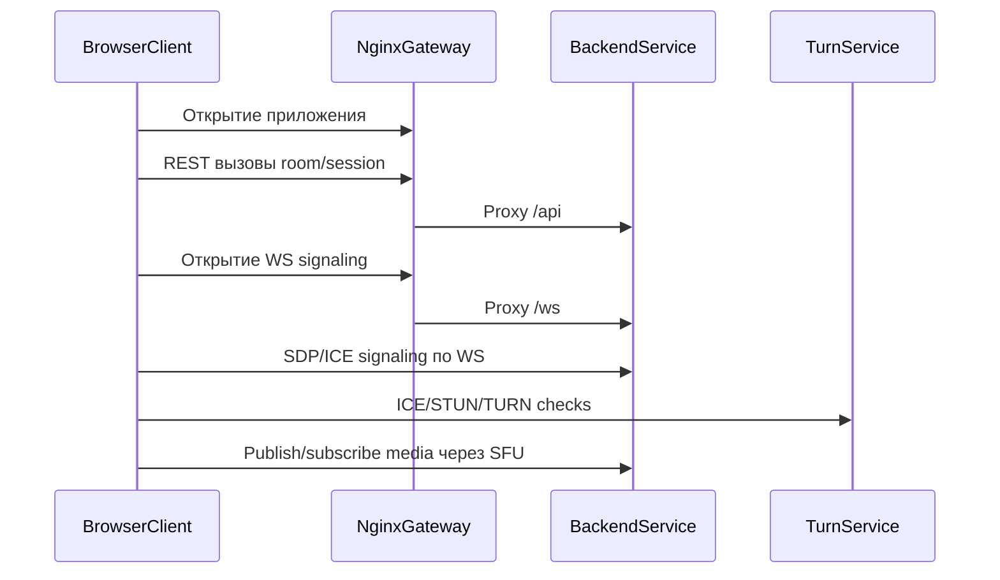

# Взаимодействие сервисов

Эта страница описывает взаимодействие сервисов на control-plane и media-plane.

## Control-plane и media-plane

| Плоскость | Основной канал | Назначение | Участники |
| --- | --- | --- | --- |
| Control-plane | HTTPS + WSS | Room API, join flow, signaling messages, диагностика. | Browser, nginx, backend |
| Media-plane | WebRTC (ICE/STUN/TURN, RTP/RTCP) | Транспорт аудио/camera/screen в реальном времени. | Browser, backend SFU, TURN |

## Сквозной сценарий: вход в комнату

## Таблица владения взаимодействиями

| Взаимодействие | Владелец (клиент) | Владелец (сервер) | Источник контракта | Что дебажить первым |
| --- | --- | --- | --- | --- |
| Room/session REST | Webapp capabilities + features | Backend HTTP adapters/application | Swagger/OpenAPI | backend logs + `/api/swagger` |
| Signaling WS messages | Webapp RTC/signaling capability | Backend signaling adapter/protocol | Protocol contracts в backend | browser exported logs + backend logs |
| SFU track orchestration | Webapp media/RTC flows | Backend media adapter/domain/application | WebRTC signaling + runtime invariants | backend logs + client diagnostics |
| TURN relay/fallback | Browser ICE agent + webapp config | TURN + deploy config | deploy env values | turn/nginx/backend logs |

## Частые точки отказа

- `room-not-found` после рестарта backend (single-node, in-memory runtime).
- Отсутствующие или невалидные TURN/ICE env values для нужной сети.
- WS signaling открыт, но negotiation падает из-за SDP/ICE рассинхронизации.
- Browser permissions или ограничения устройств до media publish.
